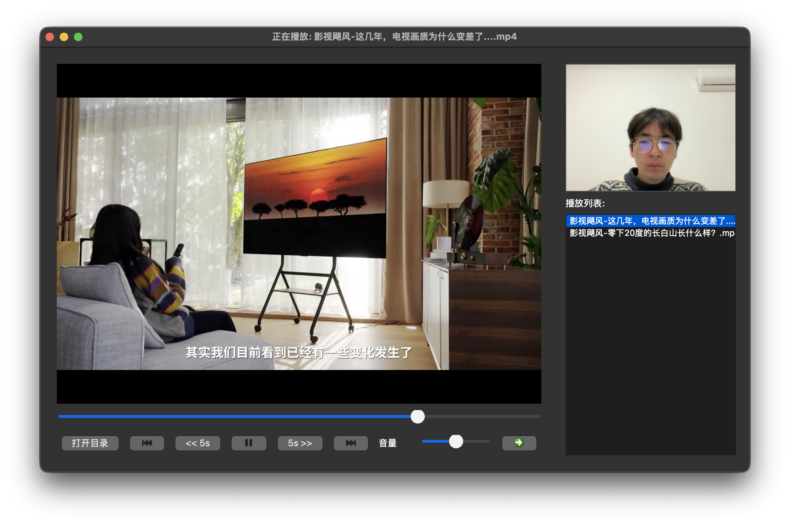
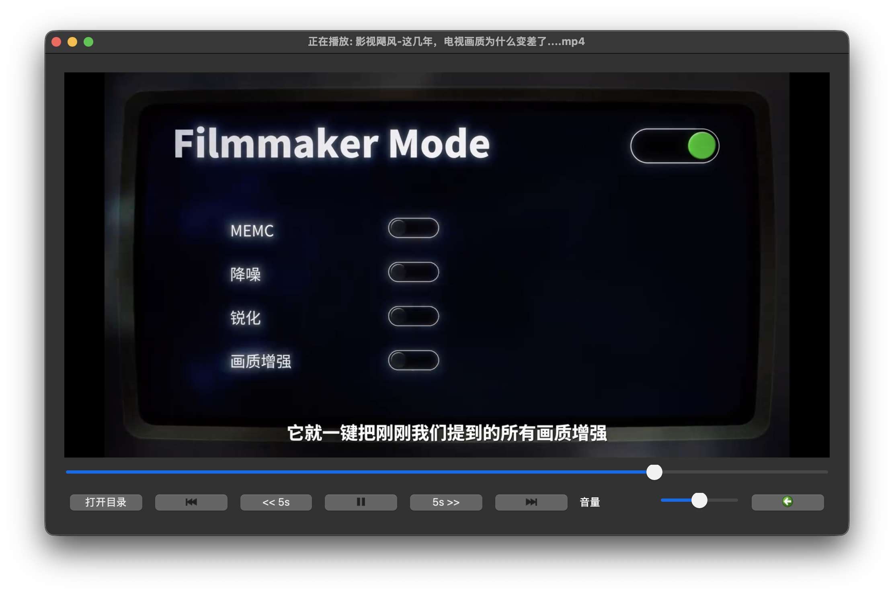
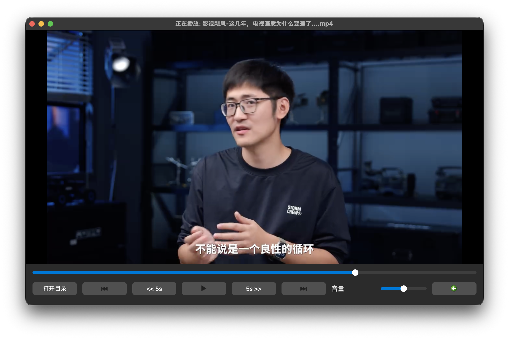
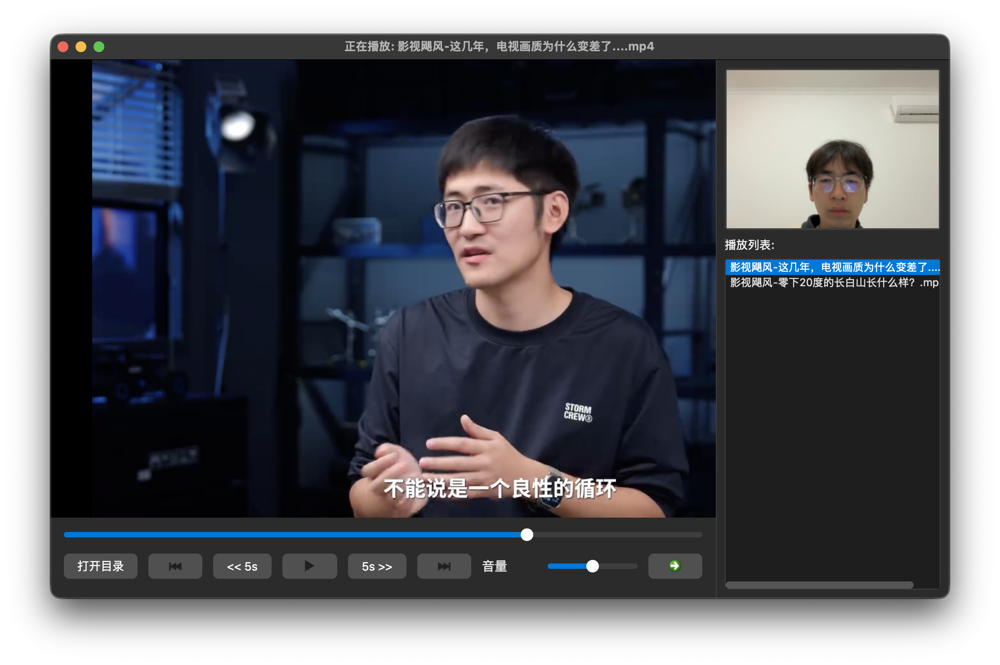
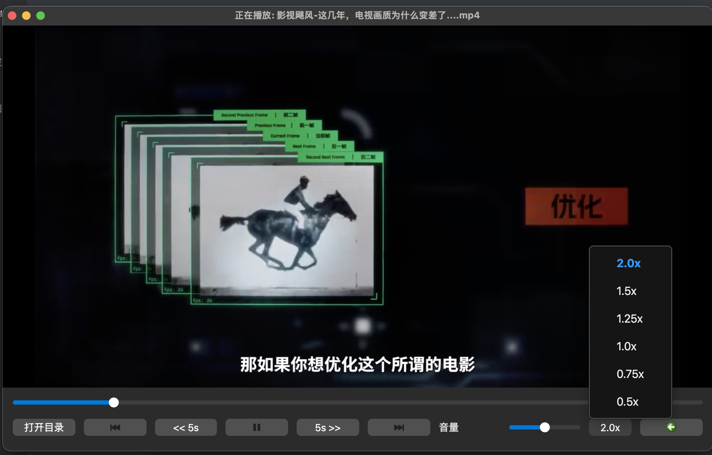
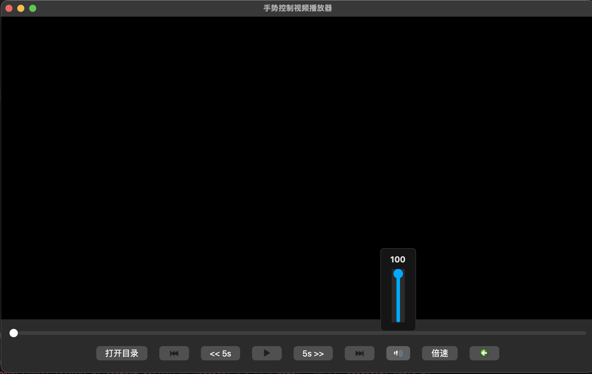
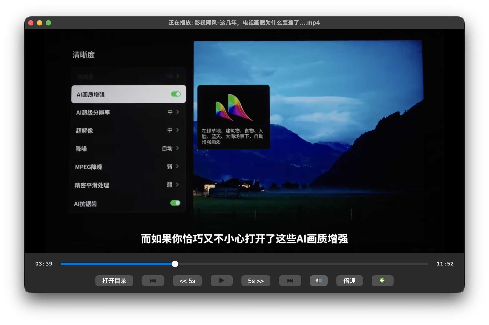
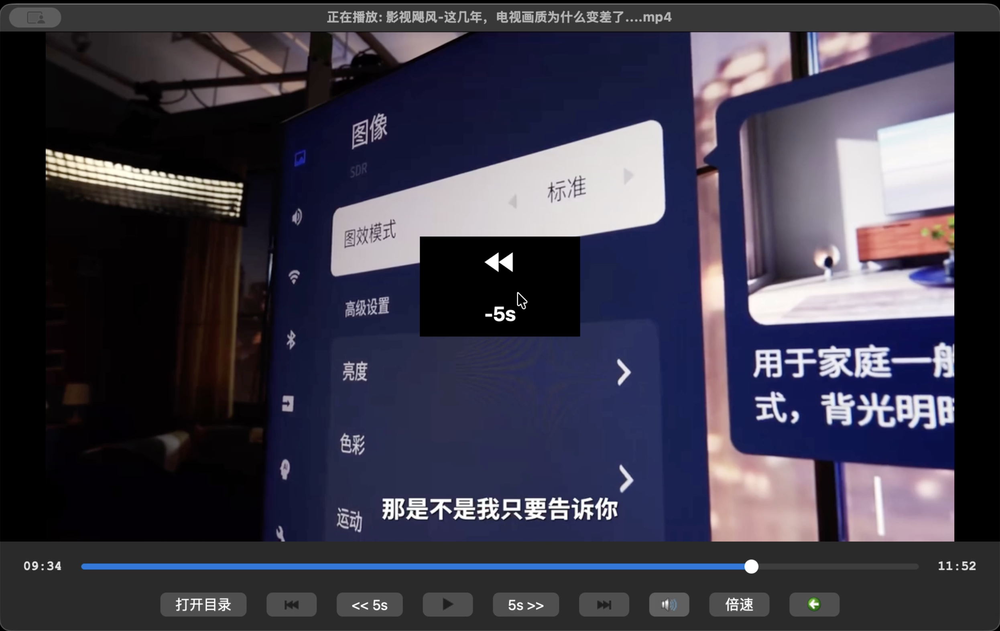
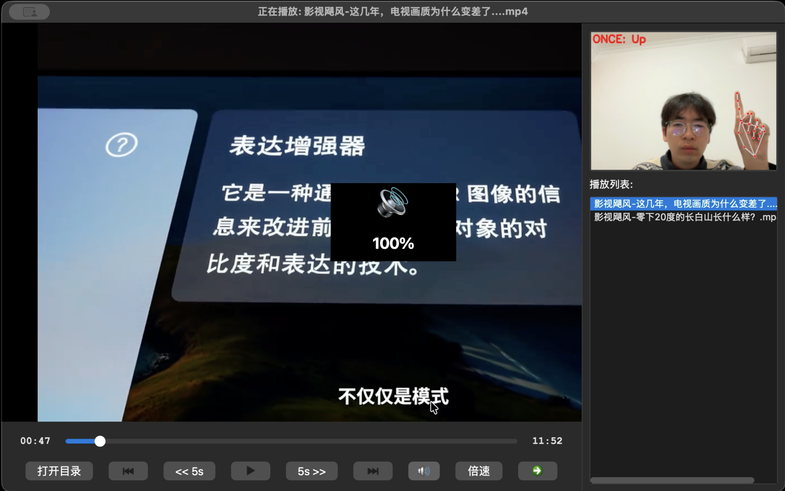
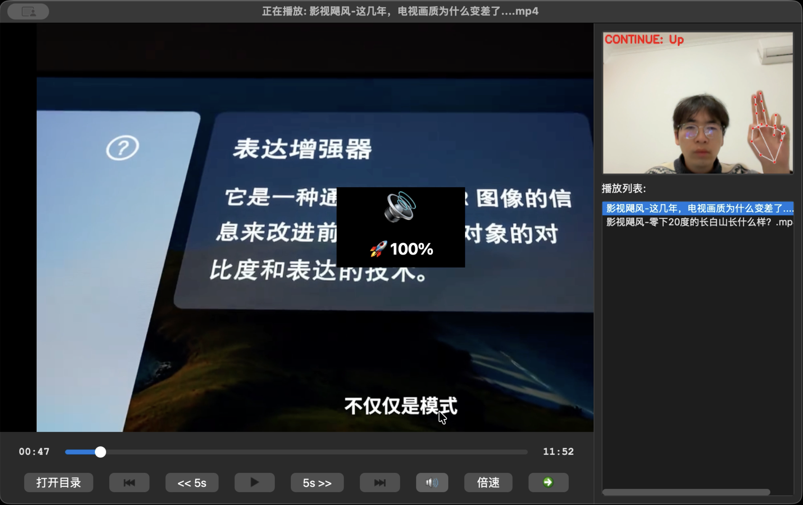

### 侧边栏问题

展开和关闭会导致播放界面尺寸拉伸，不符合常规逻辑，现改用覆盖视频内容的方式。

### 倍速播放

> 倍速播放的ui逻辑参考bilibili

### 修改底部ui

取消原来的音量条，将音量调节改为与倍速播放一样的逻辑，鼠标移动过去展示音量条

### 双击视频展开全屏

全屏模式下macos没有左上角的红绿灯🚥

### 视频时长显示

### 电脑键盘映射

左键：后退5s

右键：快进5s

上键：音量+5

下键：音量-5

空格：播放/暂停

回车：进入全屏

F键：进入全屏

ECS：退出全屏

B键：展开/关闭侧边栏

M键：静音

### 添加OSD提示

> on-screendisplay，就是视频居中位置显示提示信息

### 优化手势交互逻辑

单食指指向上下左右实现单次调节，

食指和中指并拢指向上下左右实现持续调节，频率为一秒3次

