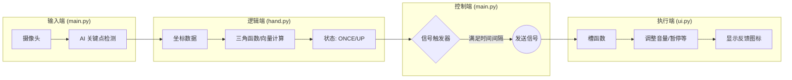

## 线程

### 1. 线程概览

| **线程名称**                     | **对应代码类/位置**                           | **主要职责**                                                 |
| -------------------------------- | --------------------------------------------- | ------------------------------------------------------------ |
| **主线程 (GUI Thread)**          | `main.py` (主程序入口)   `ui.py` (所有界面类) | 渲染界面、响应鼠标/键盘、更新画面、控制视频播放器逻辑。      |
| **手势追踪线程 (Worker Thread)** | `main.py` 中的 `HandTrackingThread` 类        | 读取摄像头、运行 MediaPipe AI 模型、计算手势几何逻辑、发射信号。 |

------

### 2. 详细任务分配

#### A. 主线程 (GUI Thread)

这是程序的“大脑”和“脸面”。它必须保持流畅，不能被阻塞，否则界面会卡死。

- **任务**:
  1. **事件循环**: 运行 `app.exec_()`，监听系统事件。
  2. **界面渲染**: 绘制 `VideoPlayer`、按钮、进度条和 OSD（屏幕显示信息）。
  3. **视频播放控制**: 调用 `QMediaPlayer` 进行播放、暂停、快进、音量调节。
  4. **摄像头画面显示**: 接收来自子线程的图片数据，将其显示在 `self.camera_label` 上。
  5. **指令执行**: 接收手势指令（如 "FIST", "Pause"），并将其转化为播放器的具体动作。

#### B. 手势追踪线程 (HandTrackingThread)

这是程序的“眼睛”和“计算中心”。它继承自 `QThread`，在后台默默工作。

- **任务**:
  1. **图像采集**: `cap.read()` 从摄像头获取原始帧。
  2. **AI 推理 (最耗时)**: `hands.process(img_rgb)` 运行 MediaPipe 模型识别手部关键点。
  3. **几何计算**:
     - 调用 `hand.py` 中的 `get_gesture_state` 计算手指弯曲和方向。
     - 计算凸包 `cv2.convexHull`。
  4. **画面处理**:
     - 使用 `cv2.putText` 在图像上绘制调试信息（如红色的 OSD 文字）。
     - 将 OpenCV 的 BGR 图像转换为 Qt 能识别的 `QImage` 对象。
  5. **逻辑判断**: 判断是否满足“连续触发”或“单次触发”的时间间隔条件。

------

### 3. 计算发生在哪里？

绝大部分**繁重的计算**都发生在 **`HandTrackingThread` (线程 2)** 中。

- **视觉计算**: 图像翻转、颜色空间转换、MediaPipe 神经网络推理、凸包计算、角度计算（`hand.py` 中的逻辑）全都在子线程完成。
- **这样做的好处**: 即使 AI 识别偶尔卡顿（比如在一台慢速电脑上），主界面的视频播放和按钮响应依然是流畅的，不会出现“界面未响应”的情况。

主线程只负责极其轻量的计算，例如简单的 UI 布局调整和将现成的图片贴到 Label 上。

------

### 4. 信号如何传递？ (跨线程通信)

由于 Qt 规定**子线程不能直接操作 UI 控件**（例如子线程不能直接 `label.setText`），所以必须通过 **信号与槽 (Signals and Slots)** 机制来传递数据。

数据流向是从 **子线程 (HandTrackingThread)** -> **主线程 (GestureControlledPlayer)**。

定义了两个信号：

1. **`frame_ready(QImage)`**
   - **传输内容**: 处理好并绘制了骨架的图像数据。
   - **触发**: 每处理完一帧摄像头画面。
   - **接收者**: 主线程的 `update_camera_feed` 函数。
   - **动作**: 主线程拿到图片，显示在右侧侧边栏。
2. **`gesture_detected(str, str)`**
   - **传输内容**: 手势模式（如 "ONCE"）和 动作（如 "Up"）。
   - **触发**: 当手势状态发生变化，或满足连续触发时间间隔时。
   - **接收者**: 主线程的 `handle_gesture_command` 函数。
   - **动作**: 主线程根据指令调整音量、快进或暂停视频。

### 总结图示

```Mermaid
graph TD
    subgraph "Thread 2: HandTrackingThread (后台)"
        A[摄像头采集 cv2.read] --> B[MediaPipe AI 推理]
        B --> C[hand.py 几何计算]
        C --> D[绘制骨架/OSD]
        D --> E{是否有手势?}
        E -- 是 --> F[发射信号: gesture_detected]
        D --> G[发射信号: frame_ready]
    end

    subgraph "Thread 1: Main GUI Thread (前台)"
        H[Qt 事件循环]
        I[槽函数: handle_gesture_command]
        J[槽函数: update_camera_feed]
        K[QMediaPlayer 视频播放]
    end

    F -- 跨线程信号 --> I
    G -- 跨线程信号 --> J
    I --> K
```

**结论**: 这是一个标准的“生产者-消费者”模型。子线程生产数据（手势指令和图像），主线程消费数据（更新 UI 和控制播放器）。


## 文件

这是一个非常经典的 **Model-View-Controller (MVC)** 变种设计模式。我们将整个项目拆解为三个部分：**界面 (View)**、**算法逻辑 (Model)** 和 **主控整合 (Controller)**。

以下是这三个文件的详细作用、内部逻辑以及整个项目的运行流程。

------

### 1. 三个文件的作用与逻辑

#### **`ui.py` —— 界面层 (The View)**

**作用**：负责所有“看得见”的东西。它构建了一个功能完整的普通视频播放器，完全不包含手势识别代码。

- **内部逻辑**：
  - **组件封装**：定义了 `OSDWidget` (屏幕显示图标)、`VolumePopup` (音量条)、`FullScreenVideoWidget` (视频渲染窗口) 等自定义控件。
  - **布局管理**：使用 `QVBoxLayout` 和 `QHBoxLayout` 搭建界面，包括底部的进度条、按钮栏和右侧的播放列表/摄像头预览框。
  - **播放器内核**：基于 `QMediaPlayer` 实现视频加载、播放、暂停、快进快退逻辑。
  - **交互响应**：处理鼠标点击（拖动进度条、双击全屏）和键盘按键（方向键快进、空格暂停）。
- **关键点**：它是一个独立的模块。你甚至可以直接运行 `ui.py`，它就是一个普通的、好用的本地视频播放器。

#### **`hand.py` —— 算法核心层 (The Logic/Model)**

**作用**：纯粹的数学计算模块。它负责“翻译”——将毫无意义的坐标数据翻译成人类理解的语义（比如“食指向上”）。

- **内部逻辑**：
  - **`get_finger_direction`**：输入一个手指的坐标，利用三角函数 (`arctan2`) 计算它是指向 上、下、左 还是 右。
  - **`get_gesture_state`**：这是“大脑”判断区。它接收所有手指的状态，进行规则匹配：
    - 0 指伸出 -> **FIST** (握拳)
    - 5 指伸出 -> **PALM** (手掌)
    - 1 指 (食指) -> **ONCE** (单次模式)
    - 2 指 (食指+中指) -> **CONTINUE** (连续模式)
- **关键点**：它不依赖 PyQt，也不依赖 OpenCV 的绘图功能，只处理数据 (NumPy)，非常轻量且易于测试。

#### **`main.py` —— 主控整合层 (The Controller)**

**作用**：程序的入口。它将 `ui.py` 的播放器和 `hand.py` 的算法连接起来，并引入 MediaPipe 进行视觉识别。

- **内部逻辑**：
  - **多线程管理 (`HandTrackingThread`)**：
    - 启动摄像头，持续读取每一帧画面。
    - 调用 MediaPipe 获得手部 21 个关键点坐标。
    - 调用 `hand.py` 进行逻辑判断。
    - **防抖与触发控制**：判断是应该“立即触发”（状态改变时）还是“连续触发”（时间间隔超过 0.33秒）。
    - 通过 Qt 信号 (`pyqtSignal`) 将结果发送出去。
  - **继承与扩展 (`GestureControlledPlayer`)**：
    - 它继承自 `ui.VideoPlayer`。这意味着它拥有播放器的所有功能，但在此基础上增加了“摄像头”和“手势监听”。
    - 它实现了 `handle_gesture_command` 函数，将接收到的信号（如 "FIST"）映射为播放器的具体操作（如 `self.player.pause()`）。

------

### 2. 整个项目的运行逻辑 (Pipeline)

整个系统像一条流水线，数据从摄像头流入，最后变成视频播放器的动作。

#### **第一阶段：感知 (在 Worker Thread 中)**

1. **采集**：`main.py` 打开摄像头，截取一帧图像。
2. **识别**：MediaPipe 分析图像，返回 21 个手部关节坐标。
3. **计算**：
   - `main.py` 算出哪些手指是伸直的 (通过凸包检测 `cv2.convexHull`)。
   - `hand.py` 计算手指指尖的方向 (向量角度计算)。
4. **决策**：
   - `hand.py` 判断当前是“单指向上”还是“握拳”。
   - `main.py` 判断是否满足时间触发条件（避免一瞬间触发几十次音量调节）。

#### **第二阶段：通信 (跨线程)**

1. **信号发射**：如果动作有效，`HandTrackingThread` 发出信号 `gesture_detected("ONCE", "Up")`。同时，处理好的带有骨架图的画面也通过 `frame_ready` 信号发出。

#### **第三阶段：执行 (在 GUI Thread 中)**

1. **画面更新**：主界面接收到图片，刷新右下角的摄像头预览。
2. **命令执行**：`GestureControlledPlayer` 接收到信号：
   - 如果是 `("FIST", "Pause")` -> 调用 `self.player.pause()`。
   - 如果是 `("CONTINUE", "Up")` -> 调用 `self.player.setVolume(current + 5)`。
3. **反馈**：播放器在屏幕中央显示一个巨大的 OSD 图标（如 🔊 55%），让用户知道操作已成功。

### 总结图

代码段

